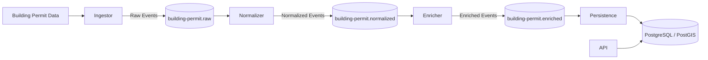
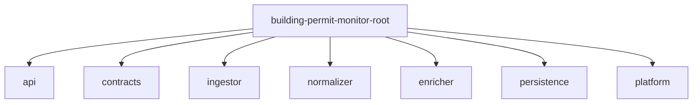
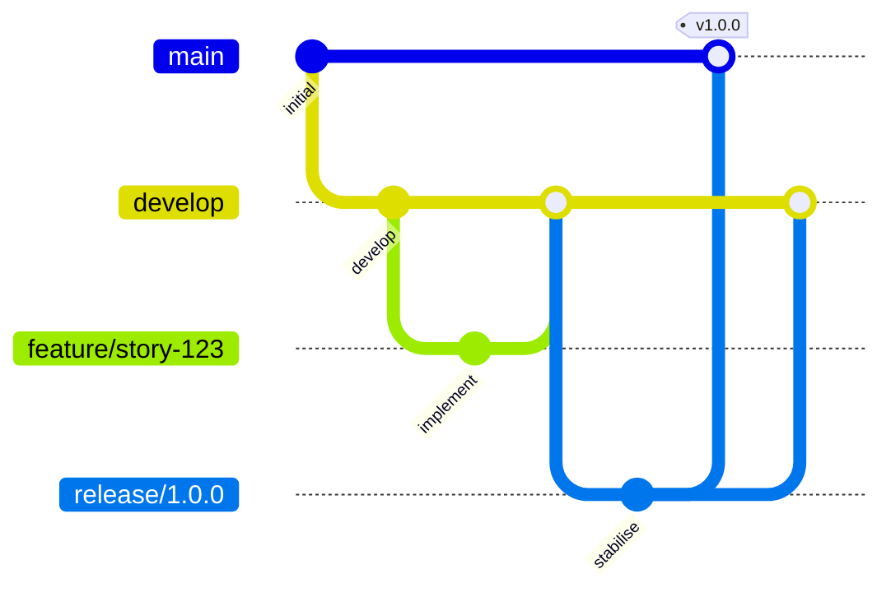
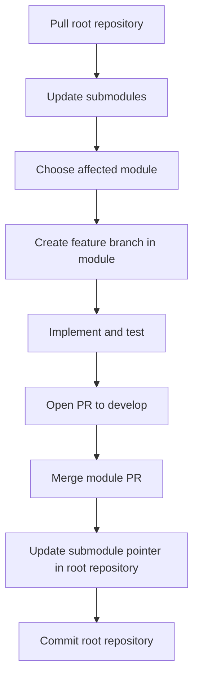
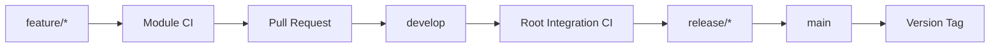

# Building Permit Monitor

[](https://openjdk.org/projects/jdk/25/)
[](https://spring.io/projects/spring-boot)
[](https://maven.apache.org/)
[](.github/workflows/)
[](LICENSE)

> A production-grade, event-driven microservice platform for monitoring Swiss building permit data.
>
> Built with Java 25, Spring Boot 4, Apache Kafka, PostgreSQL/PostGIS, Docker, GitHub Actions, Git Flow and AI-assisted software engineering using the BMad Method.

Building Permit Monitor is a modular platform for collecting, processing, enriching and storing building permit publications of the canton of Zurich.

The system continuously imports building permit data, transforms it into a standardised format, enriches it with geospatial information and stores it in a searchable PostgreSQL/PostGIS database.

This repository is the entry point for the complete platform. The individual modules are maintained in separate Git repositories and are integrated here using Git submodules.

## Engineering Highlights

This project demonstrates modern backend engineering practices:

- Event-driven microservice architecture
- Apache Kafka-based asynchronous communication
- Independent service repositories
- Git submodule-based integration repository
- Maven parent project for full-platform builds
- PostgreSQL/PostGIS persistence
- Flyway database migrations
- Dead Letter Queue handling for failed Kafka events
- GitHub Actions CI/CD
- Git Flow release management
- AI-assisted development with the BMad Method
- Java 25 and Spring Boot 4

## Architecture Overview



The services communicate through immutable Kafka events. Each stage performs one clearly defined responsibility and publishes the next event type.

## Repository Architecture



Unlike a traditional Maven multi-module project where all modules live in one Git repository, each module in this project has its own repository. This enables independent issue tracking, pull requests, CI pipelines, release cycles and ownership.

The root repository integrates these modules using Git submodules and provides the parent Maven build, shared documentation, GitHub Actions workflows and BMad artifacts.

## Repository Structure

```text
building-permit-monitor-root/
├── .github/
├── _bmad/
├── docs/
├── api/
├── contracts/
├── ingestor/
├── normalizer/
├── enricher/
├── persistence/
├── platform/
├── .gitmodules
├── pom.xml
└── README.md
```

## Modules

| Module | Purpose | Repository |
| ------ | ------- | ---------- |
| `api` | Read-only REST API for querying stored permits | Local submodule |
| `contracts` | Shared event contracts, Kafka topics, consumer groups and common configuration | [building-permit-monitor-contracts](https://github.com/wsutter/building-permit-monitor-contracts) |
| `ingestor` | Imports building permit data and publishes raw events | [building-permit-monitor-ingestor](https://github.com/wsutter/building-permit-monitor-ingestor) |
| `normalizer` | Cleans and standardises imported building permit data | [building-permit-monitor-normalizer](https://github.com/wsutter/building-permit-monitor-normalizer) |
| `enricher` | Adds geospatial information using Swiss GeoAdmin | [building-permit-monitor-enricher](https://github.com/wsutter/building-permit-monitor-enricher) |
| `persistence` | Stores enriched permits in PostgreSQL/PostGIS | [building-permit-monitor-persistence](https://github.com/wsutter/building-permit-monitor-persistence) |
| `platform` | Local development infrastructure, Docker setup and scripts | [building-permit-monitor-platform](https://github.com/wsutter/building-permit-monitor-platform) |

## Why This Repository Exists

The root repository is the integration point of the platform.

It contains:

- the parent Maven POM
- Git submodule definitions
- shared documentation
- GitHub Actions workflows for full-platform validation
- BMad specifications and skills
- integration-level configuration
- the exact module revisions that form a reproducible platform state

For most contributors, this is the repository that should be cloned first.

## Quick Start

Clone the integration repository.

```bash
git clone git@github.com:wsutter/building-permit-monitor-root.git
cd building-permit-monitor-root
```

Initialise all submodules.

```bash
git submodule update --init --recursive
```

Build the complete platform.

```bash
mvn clean verify
```

## Working with Git Submodules

The root repository stores a specific commit SHA for every module. This means a checkout of the root repository always represents a reproducible platform state.

### Clone with submodules in one step

```bash
git clone --recurse-submodules git@github.com:wsutter/building-permit-monitor-root.git
```

### Initialise submodules after cloning

```bash
git submodule update --init --recursive
```

### Update all submodules to the commits recorded by the root repository

```bash
git submodule update --recursive
```

### Pull the latest changes from all module branches

```bash
git submodule update --remote --recursive
```

### Update a single module

```bash
git submodule update --remote persistence
```

### Commit an updated submodule reference

After a module change has been merged, update the submodule pointer in the root repository.

```bash
git status
git add persistence
git commit -m "Update persistence submodule"
git push
```

The root commit now records the new module revision.

## Development Workflow

The project follows Git Flow.



### Branch Strategy

| Branch Type | Purpose |
| ----------- | ------- |
| `main` | Production-ready code. Always reflects the latest stable release. |
| `develop` | Integration branch for completed features. |
| `feature/*` | New functionality or improvements. Branched from `develop`, merged back via PR. |
| `release/*` | Release preparation. Branched from `develop`, merged into `main` and back into `develop`. |
| `hotfix/*` | Critical production fixes. Branched from `main`, merged into `main` and `develop`. |

### Daily Development Flow



Typical workflow:

1. Pull the latest root repository changes.
2. Update all submodules.
3. Work in the affected module on a `feature/*` branch.
4. Open a Pull Request into `develop` in the module repository.
5. Merge the module PR after review and CI validation.
6. Update the corresponding submodule reference in the root repository.
7. Commit and push the updated root repository state.

## GitHub Actions

Continuous Integration runs on two levels.



### Module Repositories

Each module repository validates itself independently.

Typical module build:

```bash
mvn clean verify spotless:check
```

### Root Repository

The root repository performs the integration build.

It checks out all Git submodules recursively and validates the complete Maven reactor.

```bash
mvn clean verify spotless:check
```

The root workflow is responsible for detecting cross-module compatibility issues that may not be visible in an isolated module build.

## BMad Method

This project's planning and specification artifacts are produced and maintained with the [BMad Method](https://github.com/bmad-code-org/BMAD-METHOD), a structured, agent-assisted workflow for going from product intent to implementable specifications.

The BMad artifacts live under [`docs/bmad/`](docs/bmad/) and complement the detailed engineering documentation in [`docs/README.md`](docs/README.md).

### BMad Workflow

```mermaid
flowchart TD
    PB[Project Brief] --> PRD[Product Requirements]
    PRD --> ARCH[Architecture]
    ARCH --> STORY[Story]
    STORY --> QUICKDEV[\\bmad-quick-dev]
    QUICKDEV --> MODULE[Select affected module]
    MODULE --> FEATURE[Create feature branch]
    FEATURE --> CODE[Implement change]
    CODE --> PR[Open Pull Request]
    PR --> DEVELOP[Merge into develop]
    DEVELOP --> ROOT[Update root submodule pointer]
```

BMad is configured to work together with Git Flow and Git submodules. Implementation happens inside the appropriate module repository, while the integration repository tracks the resulting submodule revisions.

### Where to Find BMad artifacts

| artifact | Location | What it is |
| -------- | -------- | ---------- |
| Project Brief | [`docs/bmad/project-brief.md`](docs/bmad/project-brief.md) | Vision, goals, MVP scope, users, constraints |
| PRD | [`docs/bmad/prd.md`](docs/bmad/prd.md) | Functional and non-functional requirements, acceptance criteria |
| Architecture | [`docs/bmad/architecture.md`](docs/bmad/architecture.md) | System design, messaging and persistence design, key decisions |
| Coding Standards | [`docs/bmad/coding-standards.md`](docs/bmad/coding-standards.md) | Conventions every module follows |
| Module Specs | [`docs/bmad/specs/`](docs/bmad/specs/) | Per-module specs for `contracts`, `ingestor`, `normalizer`, `enricher`, `persistence`, `api` and `platform` |
| Backlog & Roadmap | [`docs/bmad/backlog.md`](docs/bmad/backlog.md) | Current-state snapshot, near-term work, tech debt and post-MVP roadmap |

### How to Use the BMad artifacts

- Read in this order: Project Brief → PRD → Architecture → relevant Module Spec → Backlog.
- Use the relevant Module Spec as context before implementing a change.
- Use the Backlog to identify related work and technical debt.
- The BMad tooling is installed locally under [`_bmad/`](_bmad/).
- Run each BMad skill in a fresh context for best results.

Useful skills include:

- `bmad-help` for orientation and next steps
- `bmad-quick-dev` for intent → reviewable spec → implementation
- `bmad-prd` for product requirements updates
- `bmad-create-architecture` for architecture documentation updates

## Event Flow

### Step 1 – Import

The Ingestor reads building permit publications from external sources, currently CSV files.

A `BuildingPermitRawEvent` is created for every imported record and published to:

```text
building-permit.raw
```

### Step 2 – Normalize

The Normalizer consumes raw events and converts source-specific data into a standardised domain model.

Published to:

```text
building-permit.normalized
```

### Step 3 – Enrich

The Enricher retrieves additional information from external services.

Current enrichment:

- Swiss GeoAdmin geocoding
- WGS84 coordinates

Published to:

```text
building-permit.enriched
```

### Step 4 – Persist

The Persistence service stores enriched permits in PostgreSQL.

Spatial queries are supported through PostGIS.

## Query API

Once permits are stored, the `api` service exposes them over REST. It is a read-only query layer over PostgreSQL/PostGIS and does not participate in the Kafka pipeline.

Endpoint:

```text
GET /api/building-permits
```

Optional query parameters are applied with parameterised SQL.

| Parameter | Description |
| --------- | ----------- |
| `municipality` | Filter by municipality name |
| `category` | Filter by permit category |

Results are ordered by publication date, newest first, and capped at 500 records.

Examples:

```bash
curl http://localhost:8080/api/building-permits
curl "http://localhost:8080/api/building-permits?municipality=Thalwil"
curl "http://localhost:8080/api/building-permits?category=RENOVATION"
```

## Kafka Topics

| Topic | Description |
| ----- | ----------- |
| `building-permit.raw` | Raw imported permit events |
| `building-permit.normalized` | Standardised permit events |
| `building-permit.enriched` | Geocoded permit events |

### Dead Letter Queues

| DLQ Topic | Consumer |
| --------- | -------- |
| `building-permit.raw.dlq` | Normalizer |
| `building-permit.normalized.dlq` | Enricher |
| `building-permit.enriched.dlq` | Persistence |

Failed messages are automatically routed to the corresponding Dead Letter Queue.

## Consumer Groups

Consumer groups are centrally defined in the `contracts` module.

```java
public final class KafkaGroupIDs {

    public static final String NORMALIZER = "normalizer";
    public static final String ENRICHER = "enricher";
    public static final String PERSISTENCE = "persistence";

    private KafkaGroupIDs() {}
}
```

## Technology Stack

| Layer | Technology |
| ----- | ---------- |
| Language | Java 25 |
| Framework | Spring Boot 4 |
| Build | Maven |
| Messaging | Apache Kafka |
| Database | PostgreSQL |
| Spatial | PostGIS |
| ORM | Spring Data JPA |
| Migration | Flyway |
| Containers | Docker |
| CI/CD | GitHub Actions |
| SCM | Git, Git Flow, Git submodules |
| AI-assisted development | BMad Method |
| Documentation | Markdown, Mermaid, PlantUML, Pandoc |

## Documentation

Detailed documentation is available in the [`docs`](docs/) directory.

| Document | Description |
| -------- | ----------- |
| [`docs/README.md`](docs/README.md) | Documentation index |
| [`docs/bmad/project-brief.md`](docs/bmad/project-brief.md) | Project vision and scope |
| [`docs/bmad/prd.md`](docs/bmad/prd.md) | Product requirements |
| [`docs/bmad/architecture.md`](docs/bmad/architecture.md) | Architecture decisions and system design |
| [`docs/bmad/coding-standards.md`](docs/bmad/coding-standards.md) | Coding conventions |
| [`docs/bmad/specs/`](docs/bmad/specs/) | Module specifications |
| [`docs/bmad/backlog.md`](docs/bmad/backlog.md) | Backlog and roadmap |
| [`docs/bmad/git-flow-ci-cd-spec.md`](docs/bmad/git-flow-ci-cd-spec.md) | Git Flow and CI/CD specification |

Each module also contains its own README with implementation details specific to that service.

## Running the System

### Start Infrastructure

Start Kafka, PostgreSQL/PostGIS and supporting services from the `platform` module.

```bash
cd platform
```

Use the platform module's README for the current Docker Compose commands and service-specific details.

### Run Database Migrations

From the root repository:

```bash
mvn flyway:migrate -pl persistence
```

### Start Services

From the root repository:

```bash
mvn spring-boot:run -pl normalizer
mvn spring-boot:run -pl enricher
mvn spring-boot:run -pl persistence
mvn spring-boot:run -pl api
```

### Import Data

```bash
mvn spring-boot:run -pl ingestor
```

## Geospatial Support

The Persistence module stores coordinates using PostGIS-compatible data types.

Example use cases:

- Find permits within a radius
- Display permits on a map
- Perform geographic clustering
- Analyse regional building activity

## Data Pipeline Benefits

- Loosely coupled services
- Independent deployments
- Scalable event processing
- Fault isolation through DLQs
- Easy integration of additional enrichment stages
- Full audit trail through Kafka events
- Reproducible integration state through root-level submodule pointers

## Roadmap

### Platform

- [x] Modular microservice architecture
- [x] Apache Kafka event bus
- [x] PostgreSQL/PostGIS persistence
- [x] GitHub Actions CI/CD
- [x] Git Flow workflow
- [x] BMad integration
- [x] Git submodule-based root repository

### Next Milestones

- [ ] Kubernetes deployment
- [ ] Helm chart
- [ ] OpenTelemetry tracing
- [ ] Prometheus metrics
- [ ] Grafana dashboards
- [ ] GitHub Container Registry
- [ ] Test coverage dashboard
- [ ] Interactive map frontend
- [ ] Notification services

## Contributing

1. Clone the root repository.
2. Initialise all Git submodules.
3. Create a feature branch in the affected module repository.
4. Implement and test the change.
5. Open a Pull Request against `develop`.
6. Merge after review and successful CI.
7. Update the submodule pointer in the root repository.
8. Run the full root build.
9. Commit and push the updated root repository state.

## License

This project is licensed under the MIT License.
